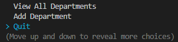
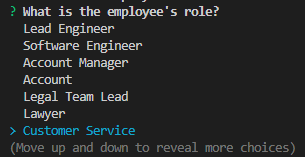

<base target="_blank">

# Employee Tracker

<a href="#description">Description</a> •
<a href="#key-features">Key Features</a> •
<a href="#installation">Installation</a> •
<a href="#usage">Usage</a> •
<a href="#technologies-used">Technologies Used</a> •
<a href="#concepts-demonstrated">Concepts Demonstrated</a> •
<a href="#author">Author</a>

-------------------------------------------------------

[Video Demo on YouTube](https://youtu.be/SESsveVqECY)

-------------------------------------------------------

## Description

<a href="#main-menu">Main Menu</a>                    
<a href="#view-all-employees">View All Employees</a>                 
<a href="#view-employees-by-department">View Employees By Department</a>              
<a href="#view-employees-by-manager">View Employees By Manager</a>              
<a href="#add-employee">Add Employee</a>                  
<a href="#update-employee-role">Update Employee Role</a>                
<a href="#view-all-roles">View All Roles</a>               
<a href="#add-role">Add Role</a>                   
<a href="#view-all-departments">View All Departments</a>                  
<a href="#add-department">Add Department</a>                 
<a href="#quit">Quit</a>             
<a href="#input-validation">Input Validation</a>             

This is just an application to display and modify information about the employees in a company.
When you start the program, you are taken to a splash page, then the main menu prompt.         

### Main Menu

The main menu prompt has several choices:                         

                      

                      

Whenever you complete an action chosen from the main menu, you are taken back to the main menu, with the exception of the "Quit" option.

### View All Employees

If you select the "View All Employees" choice, all the employees and their associated roles and departments are displayed:                

                        

### View Employees By Department

If you select the "View Employees By Department" choice, you are prompted to choose a department:

           

After you select a department, the list of employees in that department is displayed:                   

           

### View Employees By Manager

If you select the "View Employees By Manager" choice, you are prompted to choose a manager:                    

               

After you select a manager, the list of employees with that manager - or with no manager - is displayed:                     

               

### Add Employee

If you select the "Add Employee" choice, you are prompted for the first and last name of the employee:                 

             

Then you're prompted for a list of roles to choose from:                

            

Then you're prompted for a list of managers to choose from:                  

                    

When you've entered all information, the employee is added to the database and a message is displayed telling you a new employee was added:               

                    

### Update Employee Role

If you select the "Update Employee Role" choice, you are prompted to choose an employee from a list of employees to update their role:               

               

Then you're prompted for a list of roles to choose from:               

          

When you've selected all choices, the employee's role is updated and message is displayed:                            

          

### View All Roles

If you select the "View All Roles" choice, all roles and their associated department and salary are shown:                   

          

### Add Role

If you select the "Add Role" choice, you are prompted for the name and salary of the role:                   

             

Then you're prompted with a list of departments to choose from:                            

                    

When you've entered all information, the role is added to the database and a message is displayed:                 

### View All Departments

If you select the "View All Departments" choice, a list of all departments is displayed:              

### Add Department

If you select the "Add Department" choice, you are prompted to enter the name of the department to add:                  

                

If adding a department was successful, a message is displayed:                    

            

### Quit

If you select the "Quit" choice, the program quits:                  

### Input Validation

If you enter invalid information when prompted for input a message is displayed, and the prompt will not let you continue until you enter valid information:             

## Key Features

- Store information about employees, their roles, and the departments associated with that role in one program with a user interface.
- View all employees and their related role and department information.
- View all employees by department.
- View all employees by manager.
- Add an employee into the system.
- Update an existing employee's role.
- View all roles and their related department.
- Add a new role into the system.
- View all departments.
- Add a new department into the system.
- Input validation.

## Installation

- Make sure that node.js and the npm package manager are installed on your local terminal.
- Clone down the application repo into a directory.
- Navigate into the directory that the application was cloned to in a terminal and type `npm install` to install all dependencies.

## Usage

- Navigate to the directory that the application was cloned to in a terminal and type `node index.js` to run the program.
- Choose your action via the main menu prompt.

## Technologies Used

- [MySQL database software](https://www.mysql.com/)
- [mysql2 package](https://www.npmjs.com/package/mysql2)
- [mysql2-import package](https://www.npmjs.com/package/mysql2-import)
- [Inquirer package](https://www.npmjs.com/package/inquirer)
- [console.table package](https://www.npmjs.com/package/console.table)
- [node.js](https://nodejs.org/en/)
- [JavaScript](https://www.javascript.com/)

## Concepts Demonstrated

- Using MySQL to query a database for different types of information.
- Reading from and writing to a file.
- The use of node.js
- Installing and using node.js packages using npm.
- General JavaScript and programming knowledge.

## Author

Adam Ferro
- [Github](https://github.com/GeminiAd)
- [Linked-In](https://www.linkedin.com/in/adam-ferro)